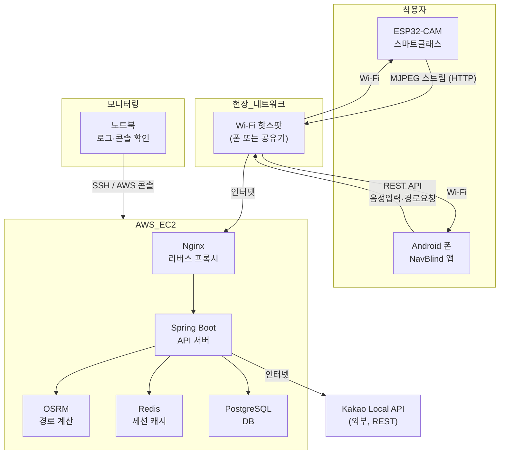

# 데모 환경

> NavBlind — 시각장애인용 스마트글래스 네비게이션 시스템
> 캡스톤 설계 보고서 | 데모 환경 섹션

---

## 데모 시나리오

시연자가 스마트글래스를 착용하고 실외(또는 실내 모의 코스)를 걸으며
**음성 목적지 입력 → 경로 안내 → 장애물 감지 → 경로 이탈·재탐색** 흐름을 순서대로 시연

---

## 기기 구성

| 역할 | 기기 | 설치/설정 사항 |
|------|------|----------------|
| 시각장애인 사용자 | Android 폰 1대 (API 26 이상) | NavBlind 앱 설치, Wi-Fi 핫스팟 연결 |
| 스마트글래스 | ESP32-CAM 실물 1대 | 안경 프레임에 마운트, 보조배터리 연결 |
| 서버 모니터링 | 노트북 (Windows) | AWS 콘솔 또는 Docker 로그 확인용 |

---

## 위치 추적

- **실외 데모 (권장)**: 실제 GPS 신호 사용 — ARCore Geospatial + FusedLocation 자동 동작
- **실내/발표장 데모**: `Fake GPS` 앱(Android)으로 특정 좌표 고정 후 도보 경로를 수동으로 이동시켜 시연
  - 이탈 감지 시연 시 Fake GPS 좌표를 경로에서 벗어난 위치로 변경

---

## 서버 및 DB

| 구성 요소 | 환경 | 비고 |
|-----------|------|------|
| Spring Boot API 서버 | AWS EC2 (t3.small 이상) | Docker Compose로 배포 |
| PostgreSQL DB | EC2 내 Docker 컨테이너 또는 AWS RDS | 데모용 소규모 인스턴스 |
| Redis | EC2 내 Docker 컨테이너 | 세션 캐시 |
| OSRM 경로 서버 | EC2 내 Docker 컨테이너 | 데모 지역 OSM 데이터만 로드 |
| Kakao Local API | 외부 REST 호출 (인프라 불필요) | POI 검색·지오코딩 |
| Nginx 리버스 프록시 | EC2 내 Docker 컨테이너 | REST + MJPEG 프록시 통합 |

---

## 네트워크 구성

- 모바일 핫스팟(폰) 또는 Wi-Fi 공유기 1대로 **ESP32-CAM ↔ Android 앱 ↔ AWS** 연결
- ESP32-CAM은 핫스팟에 연결되어 MJPEG 스트림을 폰으로 전송
- Android 앱은 동일 Wi-Fi로 스트림 수신 + AWS API 통신

---

## 기구 준비

| 기구 | 용도 | 준비 방법 |
|------|------|-----------|
| ESP32-CAM 모듈 | 스마트글래스 영상 촬영·송신 | 구매 후 펌웨어 플래시 (PlatformIO) |
| 안경 프레임 + 3D 프린트 마운트 | ESP32-CAM 착용 | 프레임에 고정 브라켓 제작 또는 테이프 임시 고정 |
| 소형 보조배터리 (5V USB) | ESP32-CAM 전원 공급 | 주머니 또는 안경다리에 테이프 고정 |
| 장애물 소품 | 객체 감지 시연용 | 교통 콘, 표지판 보드, 의자 등 현장 준비 |
| Wi-Fi 공유기 또는 폰 핫스팟 | 현장 네트워크 | 발표장 Wi-Fi 불안정 시 폰 핫스팟으로 대체 |

---

## 데모 환경 구성도

---

## 데모 시연 순서

1. ESP32-CAM 전원 ON → 핫스팟 연결 확인
2. Android 앱 실행 → 스마트글래스 자동 연결 (10초 이내)
3. 음성 입력: "○○○으로 안내해줘" → 경로 수신·음성 안내 시작
4. 보행 중 장애물 소품 앞에서 → 음성 경보 시연
5. Fake GPS 또는 실제 경로 이탈 → "경로를 재탐색합니다" 음성 출력 시연
