# 소프트웨어 설계 문서

> NavBlind — 시각장애인용 스마트글래스 네비게이션 시스템
> 캡스톤 설계 보고서 | 소프트웨어 설계 섹션

---

## 슬라이드 1 — 모듈구성도: 전체 시스템 클래스 의존 관계

### Android 앱 핵심 클래스 계층

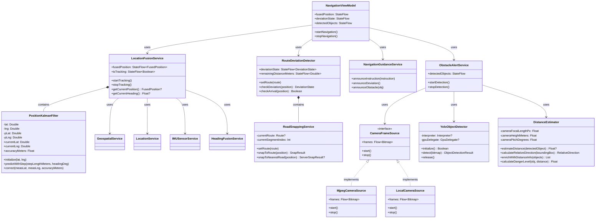

### 백엔드 클래스 계층

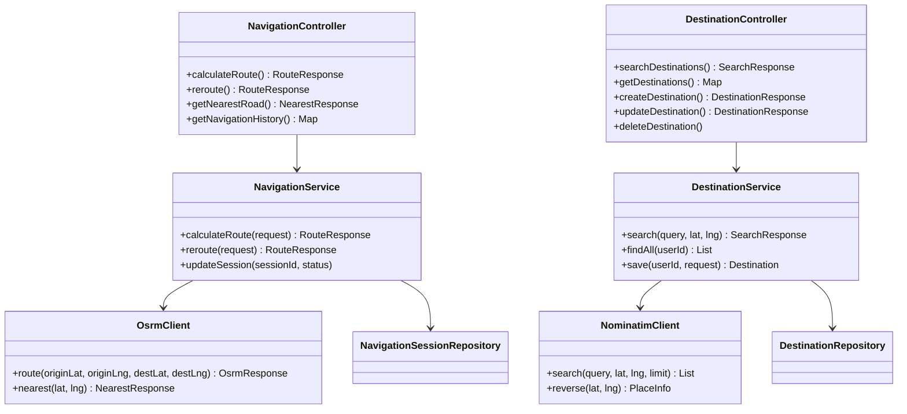

---

## 슬라이드 2 — 주요 모듈 설계: 위치 융합 서비스 (LocationFusionService)

### 모듈 역할

GPS + ARCore Geospatial API (VPS) + PDR(보행항법) 3가지 소스를 **칼만필터**로 융합하여 단일 고정확도 위치 정보를 제공한다.

### 핵심 자료구조

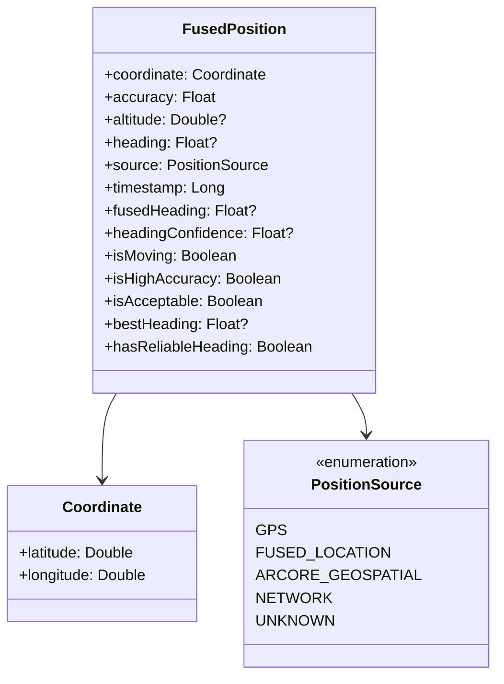

### PositionKalmanFilter 핵심 상태

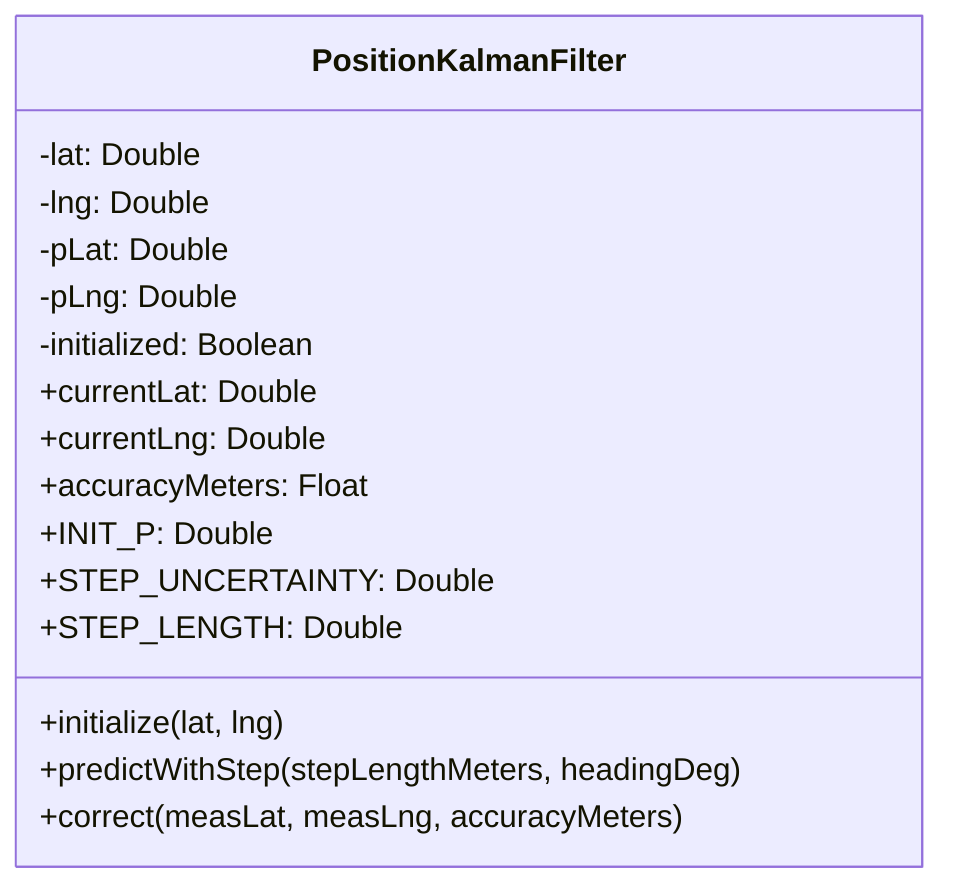

| 필드 | 타입 | 설명 |
|------|------|------|
| `lat`, `lng` | Double | 추정 위치 (상태 벡터) |
| `pLat`, `pLng` | Double | 오차 공분산 (도²) |
| `initialized` | Boolean | 필터 초기화 여부 |
| `accuracyMeters` | Float | `√pLat × 111,000` 으로 환산 |

**주요 상수:**

| 상수 | 값 | 설명 |
|------|----|------|
| `INIT_P` | `1e-4` | 초기 불확실도 (~11m) |
| `STEP_UNCERTAINTY` | `0.15 m` | PDR 한 걸음 노이즈 |
| `STEP_LENGTH` | `0.7 m` | 평균 보폭 |
| `METERS_PER_DEG_LAT` | `111,000` | 위도 1° ≈ 111km |

### 입력 소스 및 처리 주기

| 소스 | 클래스 | 주기 | 역할 |
|------|--------|------|------|
| GPS / FusedLocation | `LocationService` | ~1 Hz | KF 보정(correct) |
| ARCore Geospatial (VPS) | `GeospatialService` | ~30 fps | KF 보정, 도시 정확도 향상 |
| PDR (보행항법, 걸음 감지) | `IMUSensorService` | 3~5 Hz | KF 예측(predict), GPS 공백 보완 |

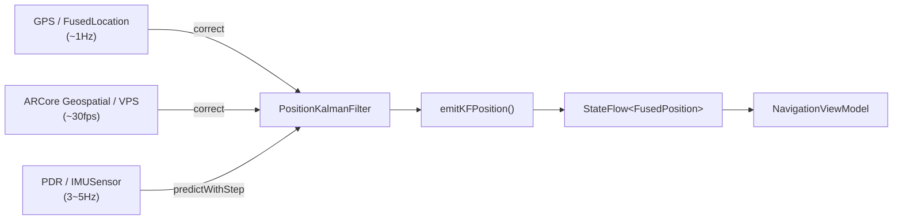

**활용 오픈소스/API:** ARCore Geospatial API (Google), Android FusedLocationProvider

---

## 슬라이드 3 — 주요 모듈 설계: 객체 검출 (YoloObjectDetector + DistanceEstimator)

### 모듈 역할

ESP32-CAM 또는 폰 카메라 프레임에서 장애물을 실시간 검출하고, 거리 추정 및 위험도를 산출하여 음성 경보로 연결한다.

### 핵심 자료구조

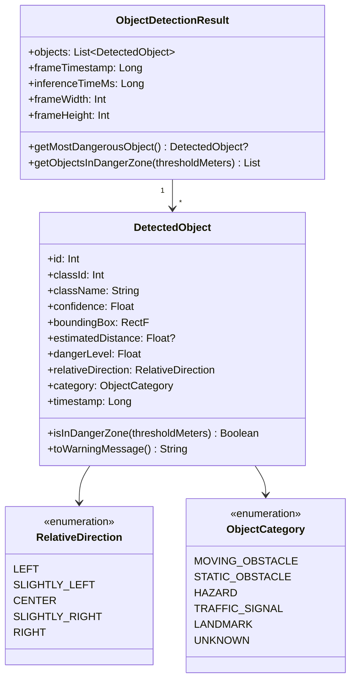

### 추론 파이프라인

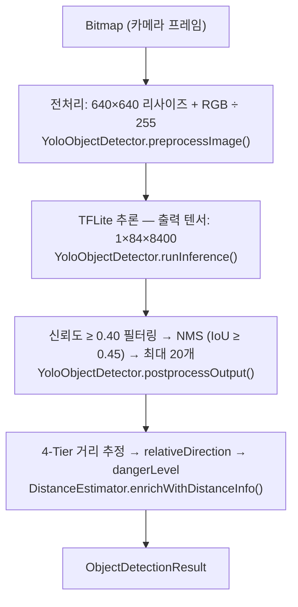

### 주요 상수

| 상수 | 값 | 설명 |
|------|----|------|
| `MODEL_FILE_NAME` | `yolov8n.tflite` | YOLOv8 nano TFLite 모델 |
| `MODEL_INPUT_SIZE` | `640 px` | 입력 해상도 |
| `CONFIDENCE_THRESHOLD` | `0.40` | 신뢰도 하한 |
| `NMS_THRESHOLD` | `0.45` | NMS IoU 임계값 |
| `MAX_DETECTIONS` | `20` | 프레임당 최대 검출 수 |
| `DETECTION_INTERVAL_MS` | `500 ms` | 검출 실행 주기 |
| `ALERT_COOLDOWN_MS` | `4,000 ms` | 동일 객체 재경보 억제 |

**카메라 파라미터 (스마트글래스 / 폰 각각 독립 설정):**

| 파라미터 | 스마트글래스 (ESP32-CAM) | 폰 카메라 |
|----------|--------------------------|-----------|
| 초점거리 (px) | 800 | 1,200 |
| 카메라 높이 (m) | 1.6 | 1.4 |
| 카메라 피치 (°) | −5 | −15 |

**활용 오픈소스:** YOLOv8n (Ultralytics), TensorFlow Lite, GPU Delegate

---

## 슬라이드 4 — 주요 API 설계

### Android ↔ 백엔드 REST API

#### Navigation API  (`/navigation`)

| 메서드 | URL | 요청 바디 | 응답 | 설명 |
|--------|-----|-----------|------|------|
| `POST` | `/navigation/route` | `RouteRequest` | `RouteResponse` | 경로 계산 |
| `POST` | `/navigation/reroute` | `RerouteRequest` | `RouteResponse` | 이탈 후 재계산 |
| `GET`  | `/navigation/nearest` | `lat`, `lng` (query) | `NearestResponse` | 도로 snap |
| `GET`  | `/navigation/sessions` | — | `Map<String, Object>` | 내비게이션 이력 |
| `PATCH`| `/navigation/sessions/{sessionId}` | `{status}` | `NavigationSessionResponse` | 세션 상태 갱신 |

#### Destination API  (`/destinations`)

| 메서드 | URL | 요청 | 응답 | 설명 |
|--------|-----|------|------|------|
| `GET`  | `/destinations/search` | `query`, `lat`, `lng`, `limit` | `SearchResponse` | POI 검색 (Nominatim) |
| `GET`  | `/destinations` | `userId` (header) | `Map<String, Object>` | 저장된 목적지 목록 |
| `POST` | `/destinations` | `userId` (header), 바디 | `DestinationResponse` | 목적지 저장 |
| `GET`  | `/destinations/{id}` | `userId` (header) | `DestinationResponse` | 목적지 상세 |
| `PATCH`| `/destinations/{id}` | `userId` (header), 바디 | `DestinationResponse` | 목적지 수정 |
| `DELETE`| `/destinations/{id}` | `userId` (header) | `204 No Content` | 목적지 삭제 |

#### 주요 DTO 구조 (백엔드 REST)

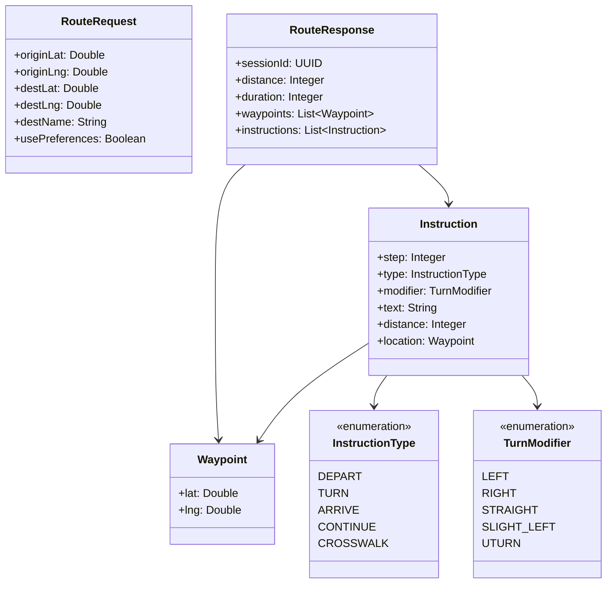

#### 주요 내부 서비스 인터페이스 (Android)

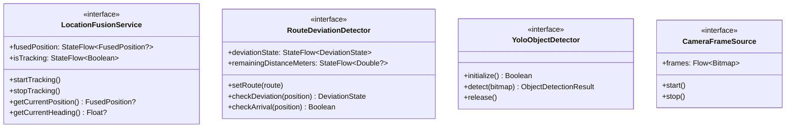

---

## 슬라이드 5 — 주요 알고리즘 1: 칼만필터 기반 위치 융합

### 개요

1-D 독립 칼만필터 2개 (위도/경도 각각)를 운용한다.
PDR 걸음 감지 시 **예측**, GPS/VPS 수신 시 **보정**을 수행한다.

### 예측·보정 사이클

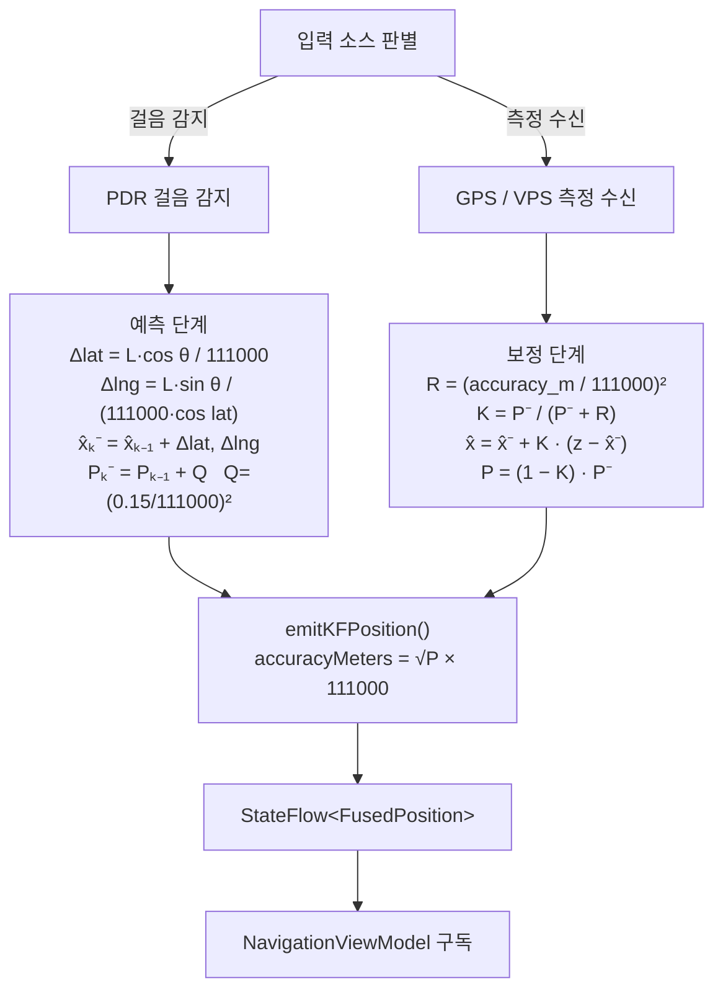

**효과:** GPS 단독 대비 보행 중 위치 오차 감소, 신호 끊김 구간에서 PDR로 연속 위치 추정 유지

---

## 슬라이드 6 — 주요 알고리즘 2: 경로 이탈 감지 (3단계 구조)

### Road Snapping + 3단계 이탈 판정

현재 위치 P를 각 경로 세그먼트에 수직 투영하여 최근접 점을 찾은 뒤, 이탈 거리에 따라 3단계로 상태를 판정한다.

**Haversine 공식 (`RoadSnappingService.haversineDistance`):**

```
a = sin²(Δlat/2) + cos(lat₁)·cos(lat₂)·sin²(Δlng/2)
c = 2·atan2(√a, √(1−a))
d = EARTH_RADIUS_METERS · c         (6,371,000 m)
```

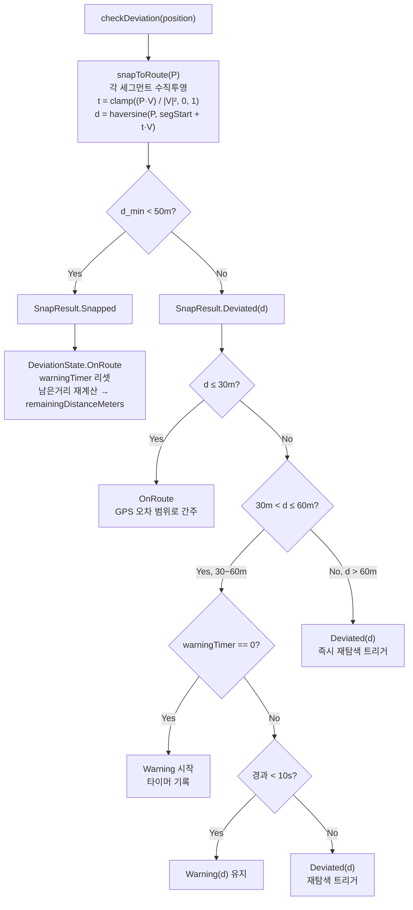

**이탈 판정 임계값:**

| 상수 | 값 | 설명 |
|------|----|------|
| `DEVIATION_THRESHOLD_WARNING` | `30 m` | 경고 시작 거리 |
| `DEVIATION_THRESHOLD_CRITICAL` | `60 m` | 즉시 재탐색 거리 |
| `WARNING_PERSIST_MS` | `10,000 ms` | 경고 유지 후 재탐색 대기 시간 |
| `ARRIVAL_THRESHOLD` | `20 m` | 도착 판정 반경 |
| `MAX_SNAP_DISTANCE` | `50 m` | Road snapping 유효 거리 |

### DeviationState 봉인 클래스

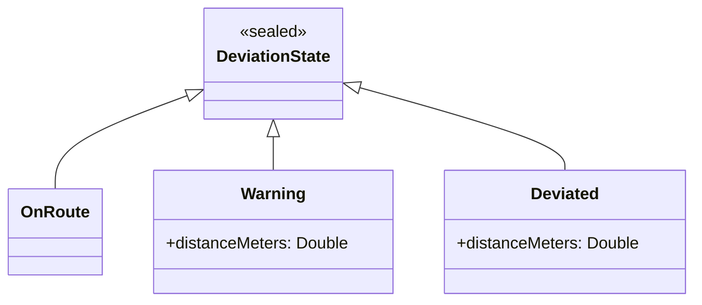

---

## 슬라이드 7 — 주요 알고리즘 3: 장애물 거리 추정 (4-Tier Fallback)

### 개요

단안 카메라(monocular)의 한계를 보완하기 위해 4가지 방법을 우선순위 순서로 시도하며, 최초 성공한 결과를 채택한다.

### 4-Tier Fallback 흐름

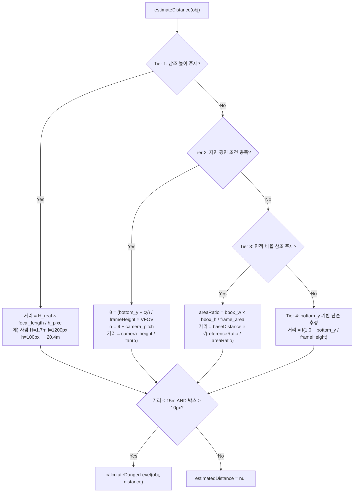

**주요 참조 높이 테이블:**

| 객체 | 실제 높이 |
|------|----------|
| 사람 | 1.7 m |
| 어린이 | 1.2 m |
| 자동차 | 1.5 m |
| 버스 | 3.0 m |
| 트럭 | 3.5 m |
| 신호등 | 0.4 m |
| 교통 콘 | 0.7 m |
| 소화전 | 0.6 m |
| 볼라드 | 1.0 m |

### 위험도 산출 (`DistanceEstimator.calculateDangerLevel`)

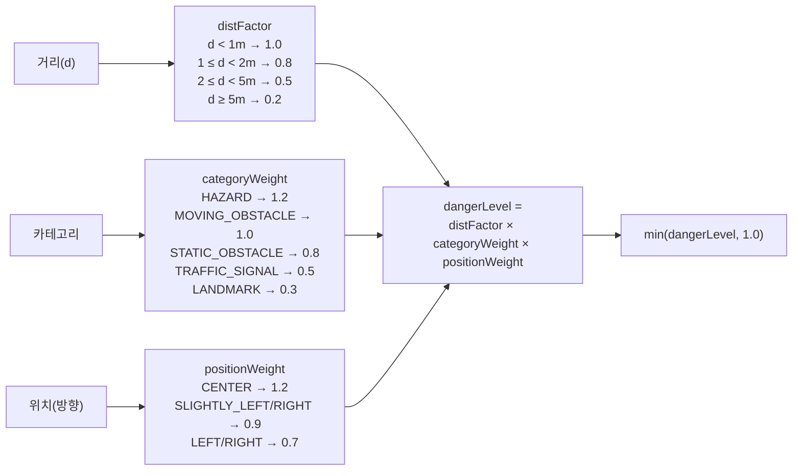

### 거리 추정 신뢰성 제한

| 상수 | 값 |
|------|----|
| `MAX_RELIABLE_DISTANCE` | `15 m` |
| `MIN_BOX_HEIGHT_PX` | `10 px` |

> `MAX_RELIABLE_DISTANCE` 이상이거나 `MIN_BOX_HEIGHT_PX` 미만인 경우 `estimatedDistance = null` 반환

---

*문서 끝 — 총 7슬라이드 분량*
