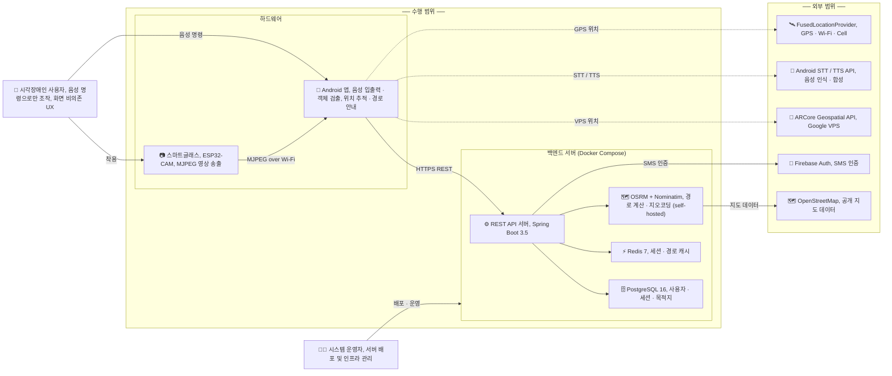
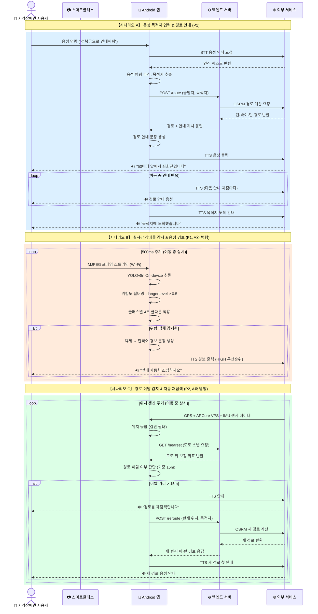

# NavBlind 서비스 흐름도 (시나리오)

> **기준**: spec 완전 구현 시 최종 서비스 흐름
> **용도**: 데모 발표용 시나리오 흐름도

---

## 1. 사용 주체 및 시스템 관계도

---

## 2. 주요 시나리오 통합 시퀀스 다이어그램

> 시나리오 A · B · C 는 실제 운용 시 **동시에 병행** 수행됩니다.

---

## 3. 시나리오 요약표

| 시나리오 | 트리거 | 주요 흐름 | 출력 |
|---------|--------|-----------|------|
| **A. 경로 안내** | 사용자 음성 명령 | STT → 경로 계산 (OSRM) → 턴-바이-턴 | TTS 음성 안내 |
| **B. 장애물 경보** | 카메라 프레임 (상시) | MJPEG → YOLOv8n 추론 → 위험도 필터 | TTS 경보 (4초 쿨다운) |
| **C. 자동 재탐색** | 경로 이탈 15m 초과 | GPS 융합 → 이탈 감지 → 재탐색 요청 | TTS 재탐색 안내 |

> **B · C는 A(경로 안내) 진행 중 상시 병행 동작**

---

*파일 위치: `c:/capstoneDesign/service-flow.md`*
*spec 기준: `specs/001-smartglass-nav-system/spec.md` (2026-01-30)*
