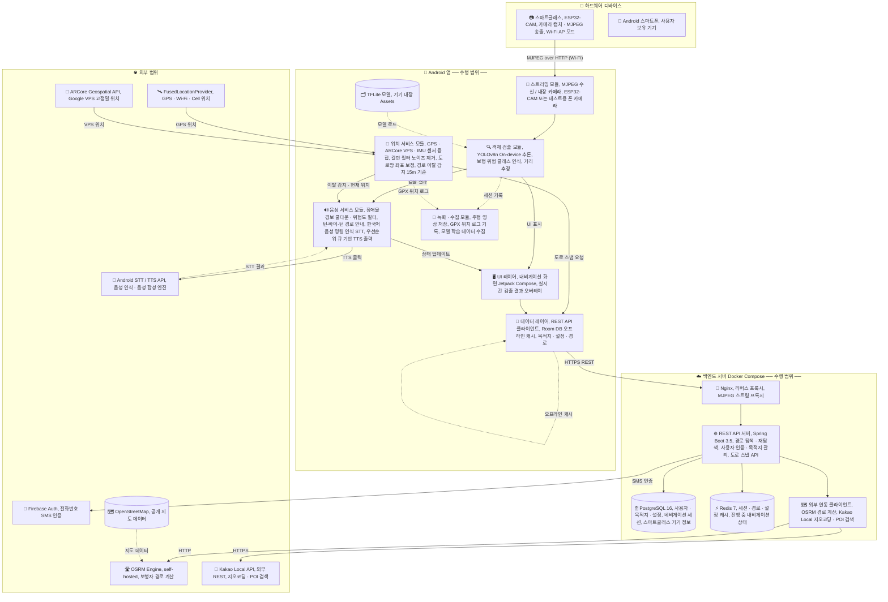

# NavBlind 전체 시스템 구성도

> **기준**: spec 완전 구현 시 최종 아키텍처 (001-smartglass-nav-system)
> **용도**: 데모 발표용 시스템 구성도 제작 참고 자료

---

## 1. 전체 시스템 개요 (ASCII)

```
╔══════════════════════════════════════════════════════════════════════════════════════════╗
║                                   【 수행 범위 】                                        ║
║                                                                                          ║
║  ┌──────────────────────┐              ┌────────────────────────────────────────────┐   ║
║  │   하드웨어 디바이스   │              │              Android 앱                    │   ║
║  │                      │  MJPEG/Wi-Fi │                                            │   ║
║  │  ┌────────────────┐  │─────────────►│  ┌─────────────┐   ┌───────────────────┐  │   ║
║  │  │  ESP32-CAM     │  │              │  │ 스트리밍 레이어│   │ 객체 검출 레이어  │  │   ║
║  │  │  스마트글래스  │  │              │  │ MjpegCamera  │──►│ YOLOv8n TFLite   │  │   ║
║  │  │                │  │              │  │ Source       │   │ DistanceEstimator │  │   ║
║  │  │  · 카메라 캡처 │  │              │  └─────────────┘   └────────┬──────────┘  │   ║
║  │  │  · MJPEG 송출  │  │              │                             │              │   ║
║  │  │  · Wi-Fi AP    │  │              │  ┌──────────────────────────▼───────────┐  │   ║
║  │  │  · 배터리 상태 │  │              │  │          음성 서비스 레이어           │  │   ║
║  │  └────────────────┘  │              │  │  ObstacleAlertService (장애물 경보)   │  │   ║
║  │                      │              │  │  NavigationGuidanceService (경로 안내)│  │   ║
║  │  ┌────────────────┐  │              │  │  VoiceInputService (STT 음성 명령)   │  │   ║
║  │  │ Android 스마트폰│  │              │  │  TextToSpeechService (TTS 음성 출력) │  │   ║
║  │  │  (사용자 보유) │  │              │  └─────────────────────────────────────┘  │   ║
║  │  └────────────────┘  │              │                                            │   ║
║  └──────────────────────┘              │  ┌─────────────────────────────────────┐  │   ║
║                                        │  │          위치 서비스 레이어          │  │   ║
║                                        │  │  LocationFusionService              │  │   ║
║                                        │  │  PositionKalmanFilter               │  │   ║
║                                        │  │  IMUSensorService / HeadingFusion   │  │   ║
║                                        │  │  RoadSnappingService → /nearest API │  │   ║
║                                        │  │  RouteDeviationDetector (15m 이탈)  │  │   ║
║                                        │  └─────────────────────────────────────┘  │   ║
║                                        │                                            │   ║
║                                        │  ┌─────────────────────────────────────┐  │   ║
║                                        │  │          UI / ViewModel 레이어       │  │   ║
║                                        │  │  NavigationViewModel                │  │   ║
║                                        │  │  DetectionViewModel                 │  │   ║
║                                        │  │  NavigationScreen (Compose)         │  │   ║
║                                        │  └──────────────────┬──────────────────┘  │   ║
║                                        │                     │ HTTPS REST           │   ║
║                                        └─────────────────────┼────────────────────┘   ║
║                                                              │                          ║
║  ┌───────────────────────────────────────────────────────────▼────────────────────┐    ║
║  │                          백엔드 서버 (Docker Compose)                           │    ║
║  │                                                                                 │    ║
║  │  [Nginx] ──► [Spring Boot 3.5]  ──► [PostgreSQL 16]                            │    ║
║  │  (Reverse       NavigationController   User / Destination                      │    ║
║  │   Proxy /       AuthController         Preference / NavigationSession           │    ║
║  │   MJPEG         DestinationController  SmartGlasses                            │    ║
║  │   Proxy)        NavigationService                                               │    ║
║  │                 UserService        ──► [Redis 7]                               │    ║
║  │                                        Session Cache / Route Cache              │    ║
║  │                                        User Prefs Cache                         │    ║
║  │                 OsrmClient ──────────────────────────────────────────────────► │    ║
║  │                 KakaoLocalClient ───────────────────────────────────────────►  │    ║
║  └───────────────────────────────────────────────────────────────────────────────┘    ║
║                                                                                          ║
╚══════════════════════════════════════════════════════════════════════════════════════════╝
           │ Firebase Auth          │ OSRM (self-hosted)     │ ARCore API
           │ (전화번호 SMS 인증)    │ 보행자 경로 계산       │ Android STT/TTS API
           │                        │ OSM 지도 데이터        │ FusedLocationProvider
           ▼                        ▼                        ▼
╔══════════════════════════════════════════════════════════════════════════════════════════╗
║                                  【 외부 범위 】                                         ║
║                                                                                          ║
║  Firebase Auth   │  OSRM Engine      │  Kakao Local API  │  OpenStreetMap               ║
║  (Google 제공)   │  (self-hosted)    │  (외부 REST)      │  (공개 지도 데이터)           ║
║                  │                   │                   │                              ║
║  ARCore          │  Android Speech   │  Android TTS API  │  Android                     ║
║  Geospatial API  │  Recognition API  │  (Google TTS)     │  FusedLocationProvider       ║
║  (Google VPS)    │                   │                   │  (GPS + Network)             ║
╚══════════════════════════════════════════════════════════════════════════════════════════╝
```

---

## 2. Mermaid 다이어그램 (렌더링용)

> GitHub, Notion, Obsidian 등에서 바로 렌더링됩니다.



---

## 3. 모듈별 상세 설명표

### 3-1. 하드웨어 모듈

| 모듈 | 플랫폼 | 역할 | 인터페이스 |
|------|--------|------|-----------|
| ESP32-CAM 스마트글래스 | C++ (Arduino) | 카메라 캡처 + MJPEG 스트리밍 | HTTP MJPEG over Wi-Fi |
| Android 스마트폰 | Android API 34 | 모든 소프트웨어 실행 | 사용자 디바이스 |

### 3-2. Android 앱 소프트웨어 모듈

| 레이어 | 모듈 | 역할 |
|--------|------|------|
| **스트리밍** | MjpegCameraSource | ESP32-CAM HTTP MJPEG 수신 |
| | LocalCameraSource | CameraX 내장 카메라 (테스트 대체) |
| **객체 검출** | YoloObjectDetector | YOLOv8n TFLite 온디바이스 추론 |
| | DistanceEstimator | BBox 크기 기반 거리 추정 |
| **위치** | LocationFusionService | GPS + ARCore + IMU 융합 |
| | PositionKalmanFilter | 위치 노이즈 제거 |
| | IMUSensorService | 가속도계·자이로 데이터 수집 |
| | HeadingFusionService | IMU + VPS 방위각 융합 |
| | RoadSnappingService | 도로망 위 좌표 보정 (백엔드 /nearest 연동) |
| | RouteDeviationDetector | 경로 이탈 감지 (기준: 15m) |
| **음성** | ObstacleAlertService | 장애물 → TTS 경보 (4초 쿨다운, 최고 위험 1개) |
| | NavigationGuidanceService | 턴-바이-턴 경로 음성 안내 |
| | VoiceInputService | 한국어 STT 음성 명령 수신 |
| | VoiceCommandParser | 음성 명령 파싱 |
| | DetectionToSpeechConverter | 감지 객체 → 한국어 자연어 문장 |
| | InstructionToSpeechConverter | OSRM 경로 지시 → 한국어 |
| | RelativeDirectionConverter | 절대 방위각 → 좌/우/앞 상대 방향 |
| | TextToSpeechService | 우선순위 큐 기반 TTS 출력 |
| **UI** | NavigationScreen | Jetpack Compose 메인 화면 |
| | NavigationViewModel | 경로 안내 상태 관리 |
| | DetectionViewModel | 실시간 검출 결과 UI 노출 |
| **데이터** | NavigationApi (Retrofit) | 백엔드 REST API 호출 |
| | Room DB | 목적지·설정·경로 오프라인 캐시 |
| **녹화** | DataCollectionService | 주행 데이터 수집 조율 |
| | GpxRecorder | 위치 이동 경로 GPX 저장 |
| | MjpegRecorder | 영상 스트림 저장 |

### 3-3. 백엔드 서버 모듈

| 컴포넌트 | 기술 | 역할 |
|----------|------|------|
| Nginx | Nginx | HTTPS 리버스 프록시, MJPEG 스트림 프록시 |
| NavigationController | Spring Boot | 경로 탐색·재탐색·도로 스냅 REST API |
| AuthController | Spring Boot | Firebase 토큰 검증, 세션 발급 |
| DestinationController | Spring Boot | 저장 목적지 CRUD, Kakao POI 검색 |
| NavigationService | Spring Boot | OSRM 연동, 경로 계산 비즈니스 로직 |
| OsrmClient | Spring Boot | OSRM /route, /nearest 호출 |
| KakaoLocalClient | Spring Boot | 지오코딩, POI 검색 |
| PostgreSQL 16 | DB | User / Destination / Preference / NavigationSession / SmartGlasses 영구 저장 |
| Redis 7 | Cache | Session·Route·UserPrefs·ActiveNav 캐시 |

### 3-4. 외부 연동 시스템

| 시스템 | 제공자 | 역할 | 수행 범위 여부 |
|--------|--------|------|--------------|
| Firebase Auth | Google | 전화번호 SMS 인증 | **외부** |
| OSRM Engine | self-hosted | 보행자 경로 계산 | **수행 범위** (자체 운영) |
| Kakao Local API | Kakao | 지오코딩 / POI 검색 | **외부** |
| OpenStreetMap | OSM Foundation | 지도 원본 데이터 | **외부** |
| ARCore Geospatial API | Google | VPS 기반 고정밀 위치 | **외부** |
| Android Speech Recognition | Google/Android | 한국어 STT | **외부** |
| Android TTS API | Google/Android | 한국어 TTS 엔진 | **외부** |
| FusedLocationProvider | Android OS | GPS + Wi-Fi + Cell 위치 | **외부** |

---

## 4. 주요 데이터 흐름 요약

### 흐름 1: 음성 목적지 입력 → 경로 안내
```
사용자 음성
  → VoiceInputService (STT)
  → VoiceCommandParser
  → NavigationViewModel
  → NavigationApi → 백엔드 /route
  → OSRM 경로 계산
  → NavigationGuidanceService
  → InstructionToSpeechConverter
  → TextToSpeechService
  → 음성 출력 ("50미터 앞에서 좌회전입니다")
```

### 흐름 2: 실시간 장애물 감지 → 음성 경보
```
ESP32-CAM MJPEG 스트림
  → MjpegCameraSource (500ms 샘플링)
  → YoloObjectDetector (YOLOv8n TFLite 온디바이스)
  → ObstacleAlertService (dangerLevel ≥ 0.5, 4초 쿨다운)
  → DetectionToSpeechConverter
  → TextToSpeechService
  → 음성 출력 ("앞에 자동차 조심하세요")
```

### 흐름 3: 위치 융합 → 경로 이탈 감지 → 재탐색
```
GPS (FusedLocationProvider)
  + ARCore Geospatial (VPS)        ─┐
  + IMUSensorService (가속도·자이로) ─┼→ LocationFusionService
  + HeadingFusionService            ─┘   → PositionKalmanFilter
                                          → RoadSnappingService (/nearest API)
                                          → RouteDeviationDetector (15m 초과)
                                          → NavigationViewModel
                                          → 백엔드 /reroute
                                          → 음성 출력 ("경로를 재탐색합니다")
```

---

## 5. 인프라 구성 (Docker Compose)

```
docker-compose.yml
├── nginx          (포트 80/443)
│     └── MJPEG 스트림 프록시 (:8081/stream)
│     └── API 리버스 프록시 (:8080/v1/*)
├── backend        (Spring Boot, 포트 8080)
├── postgres       (포트 5432)
├── redis          (포트 6379)
└── osrm           (포트 5000) ← OpenStreetMap 데이터 사전 로드
```

---

*파일 위치: `c:/capstoneDesign/system-architecture.md`*
*spec 기준: `specs/001-smartglass-nav-system/spec.md` (2026-01-30)*
