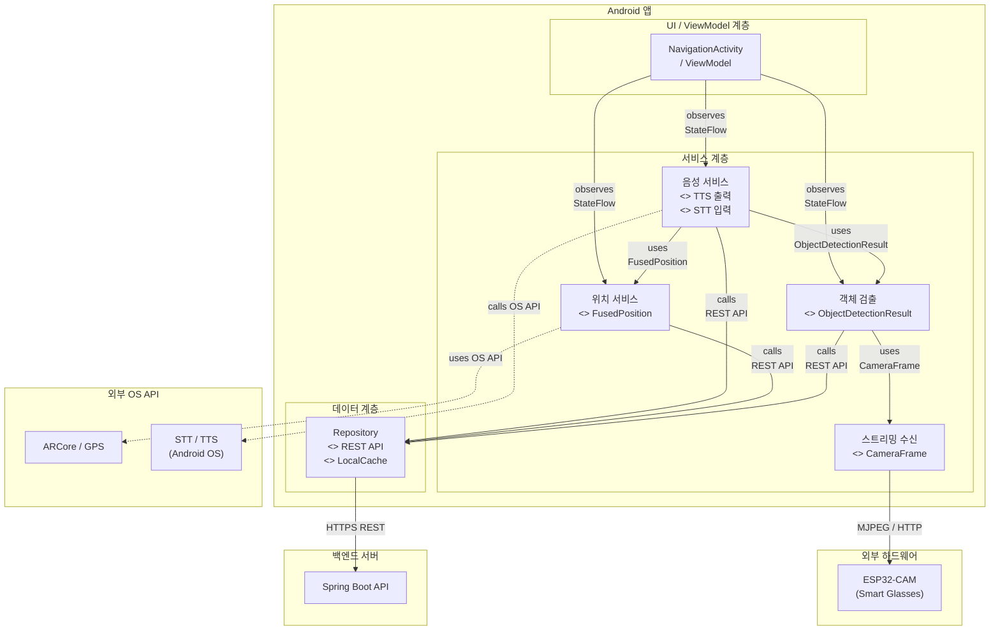
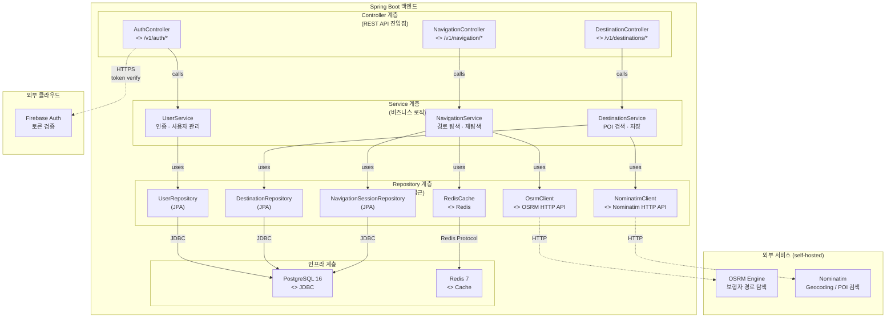
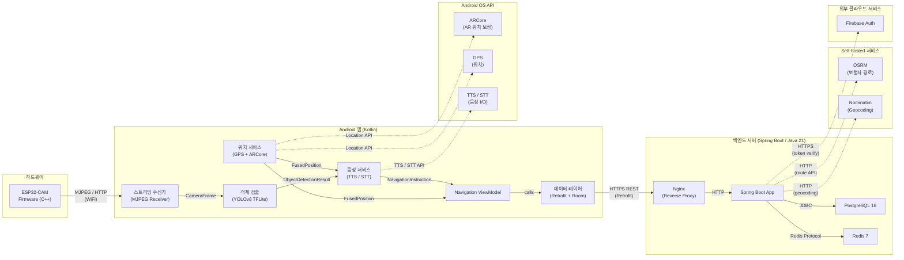

# UML 컴포넌트 다이어그램 — NavBlind 시스템

> Mermaid `graph LR/TB` + subgraph 로 UML Component Diagram 근사 표현.
> 렌더링 확인: [mermaid.live](https://mermaid.live)

---

## 다이어그램 1 — Android 앱 컴포넌트 다이어그램

---

## 다이어그램 2 — 백엔드 레이어드 아키텍처 컴포넌트 다이어그램

---

## 다이어그램 3 — 전체 시스템 컴포넌트 의존 관계도

---

## 인터페이스 요약표

| 컴포넌트 | 제공 인터페이스 (`<<provides>>`) | 요구 인터페이스 (`<<requires>>`) |
|---|---|---|
| ESP32-CAM | MJPEG HTTP 스트림 | WiFi 네트워크 |
| 스트리밍 수신기 | CameraFrame (Bitmap) | MJPEG HTTP 엔드포인트 |
| 객체 검출 | ObjectDetectionResult | CameraFrame |
| 위치 서비스 | FusedPosition | ARCore API, GPS API |
| 음성 서비스 | TTS 출력, NavigationInstruction | ObjectDetectionResult, FusedPosition, TTS/STT OS API |
| 데이터 레이어 | LocalCache (Room), REST 래퍼 | HTTPS REST API |
| NavigationController | `/v1/navigation/*` REST | NavigationService |
| NavigationService | 경로 계산 결과 | OsrmClient, SessionRepository, Redis |
| OsrmClient | Route 객체 | OSRM HTTP API |
| NominatimClient | POI 검색 결과 | Nominatim HTTP API |
| PostgreSQL | JDBC | 디스크 스토리지 |
| Redis | Cache API | 메모리 |
